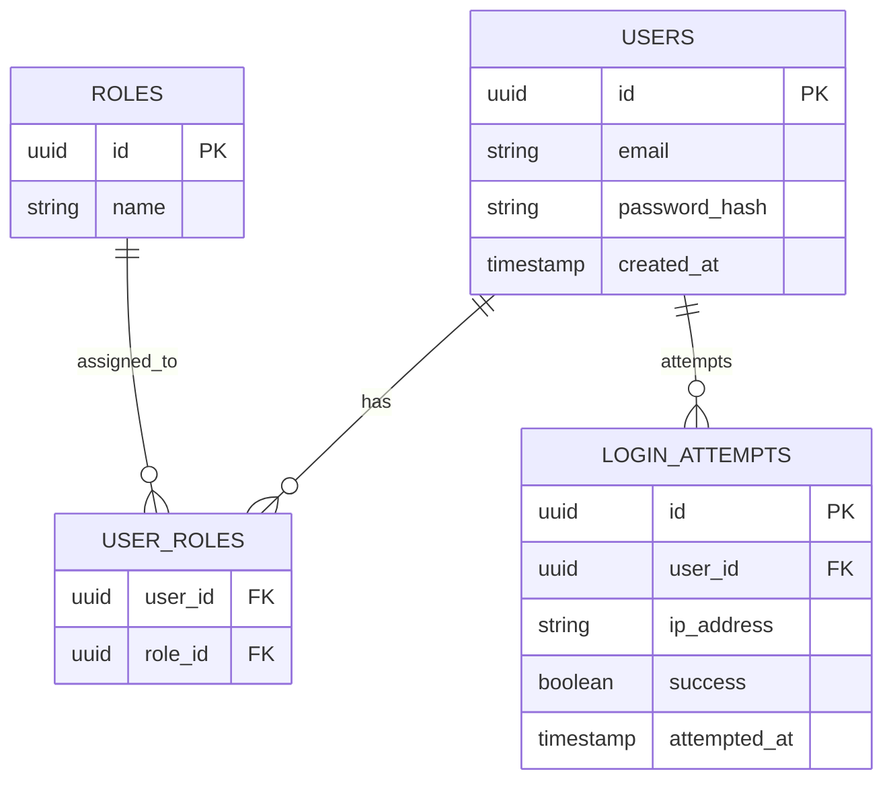

## Notes

- **`USER_ROLES` is a join table**, not a single `role` column on `USERS` — this
  makes the schema genuinely support a user holding multiple roles, which a flat
  column would block.
- **`LOGIN_ATTEMPTS` logs every attempt** (success and failure), not just a running
  counter — this is the durable audit trail the observability requirements (Phase 7)
  read from, distinct from the ephemeral Redis lockout counters described in
  ADR-004. The two serve different purposes: Redis answers "should this request be
  blocked right now," Postgres answers "what happened, historically."
- `password_hash` stores the BCrypt output described in ADR-002, never plaintext.
