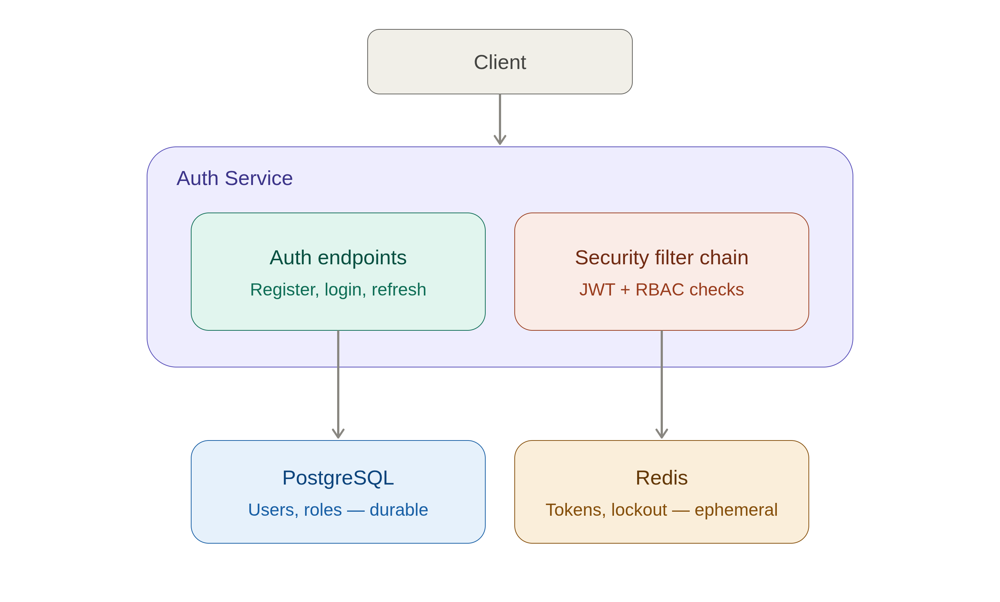

# High-Level Design — Identity & Access Management Platform

## Components

**Auth Service** (this repo)
Spring Boot application exposing REST endpoints for registration, login, token
refresh, logout, and password reset. Owns all business logic around credential
validation, token issuance, and lockout tracking.

**PostgreSQL** — system of record
Stores `users`, `roles`, and `login_attempts`. This is the durable source of truth —
if Redis is flushed, the platform survives; if Postgres is lost, user accounts are
lost. Chosen over a NoSQL store because the data is inherently relational (users ↔
roles) and strong consistency matters more than horizontal write throughput at this
scale.

**Redis** — fast, ephemeral state
Holds three things, each with a reason it doesn't belong in Postgres:
- **Refresh token / session state** — needs sub-millisecond reads on every
  authenticated request; TTL expiry is native to Redis and would require a cron job
  to fake in Postgres.
- **Token blacklist** (for logout before natural JWT expiry) — same reasoning: a
  short-lived set with automatic expiry.
- **Login attempt counters** (for lockout) — high write frequency, naturally
  ephemeral (resets after a cooldown window), a poor fit for a durable table.

## Request Flows

**Registration**
`Client → Auth Service`: validate input → hash password (BCrypt) → persist `User`
row → (future: emit "user registered" event, currently synchronous, no downstream
consumer yet in v1) → return 201.

**Login**
`Client → Auth Service`: validate credentials → check lockout counter in Redis →
on success, issue JWT access token (short-lived, ~15 min) + refresh token (longer
-lived, stored server-side in Redis) → on failure, increment lockout counter →
return 200 or 401/423.

**Authenticated request (e.g. `GET /me`)**
`Client → Auth Service`: Spring Security filter validates JWT signature + expiry →
checks Redis blacklist (was this token explicitly logged out?) → if valid, resolve
user + roles → proceed to controller.

**Refresh**
`Client → Auth Service`: validate refresh token against Redis → issue new access
token, rotate refresh token (invalidate the old one, issue a new one) → this rotation
is deliberate — a stolen refresh token becomes single-use, limiting replay risk.

**Logout**
`Client → Auth Service`: add current access token's ID (`jti` claim) to the Redis
blacklist with TTL matching the token's remaining lifetime → remove refresh token
from Redis.

## Sync vs Async Boundaries

Everything in v1 is **synchronous** — registration, login, and token operations all
respond within the same request/response cycle. There is no message queue in this
service yet. The one place async will matter is the eventual hookup to the
Notification Service (project 2 in the portfolio sequence): sending a
"password reset" email should not block the API response, and will be emitted as an
event once that service exists. For v1, that step is stubbed as a synchronous log
line, with the seam left visible in the code (a single method call this can later be
swapped for a Kafka publish) rather than half-built async plumbing with nothing
consuming it yet.

## Why not just Postgres for everything?

Could lockout counters and session state live in Postgres alone? Yes, technically —
but every login would then cost a write-heavy round trip to the durable store for
data that's inherently temporary, and TTL-based expiry (tokens, lockout windows)
would need to be hand-rolled with scheduled cleanup jobs instead of coming for free.
Redis exists here specifically because the access pattern (high frequency, short
lived, expiry-driven) doesn't match what a relational store is good at — this is the
kind of tradeoff worth being able to explain out loud, since "why two databases
instead of one" is a near-guaranteed interview question for this project.

## What's deliberately NOT decided here
Exact hashing algorithm, exact JWT storage location, and exact lockout thresholds are
tradeoff decisions with real alternatives — those are captured individually in
`docs/adr/` rather than baked into this document, so each can be revisited on its own
without rewriting the whole design.
